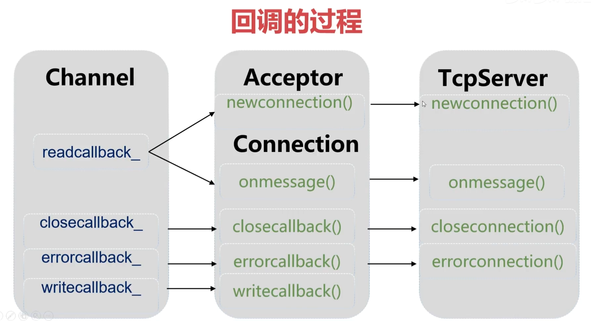
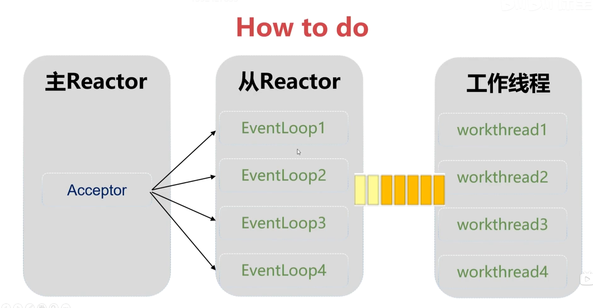

==**难点在：线程池、智能指针、异步唤醒事件循环、清理空闲的Connection、服务程序的退出。**==

# InetAddress类

# Socket类

# Epoll类

# Channel类

## 1）.函数指针与回调函数

**函数指针**

假设函数的原型是：**int func1(int bh,string str);**

则函数指针的声明是：**int  (*pfa)(int,string);**

```cpp
void (*pfunc)(int, string);      // 声明表白函数的函数指针。
pfunc = func;   
pfunc(bh, message);         // 用函数指针名调用函数。 C++
(*pfunc)(bh, message);       // 用函数指针名调用函数。 C语言
```

**回调函数：**

```cpp
#include <iostream>         // 包含头文件。
using namespace std;        // 指定缺省的命名空间。
void zs(int a)         // 张三的个性化表白函数。
{
	cout  <<"a=" << a << "我要先翻三个跟斗再表白。\n";   // 个性化表白的代码。
}
void ls(int a)         // 李四的个性化表白函数。
{
	cout << "a=" << a << "我有一只小小鸟。\n";   // 个性化表白的代码。
}
void show(void (*pf)(int),int b)
{
	cout << "表白之前的准备工作已完成。\n";       // 表白之前的准备工作。
	pf(b);                                                                     // 用函数指针名调用个性化表白函数。
	cout << "表白之后的收尾工作已完成。\n";       // 表白之后的收尾工作。
}
int main()
{
	show(zs, 3);          // 张三要表白。
	show(ls, 4);          // 李四要表白。
}
```

## 2）.可调用对象的包装器和绑定器

C++11新增了很多特性，只有三个可以称之为神器：智能指针、移动语义、包装器和绑定器。

这部分知识需要先回顾，比较重要。没怎么理解！

简单的补充：

function包装器:

```cpp
struct CC	// 类中有普通成员函数。
{
	void show(int bh, const string& message) {
		cout << "亲爱的" << bh << "，" << message << endl;
	}
};
int main()
{
	// 类的非静态成员函数。
	CC cc;
	function<void(CC&,int, const string&)> fn11 = &CC::show;	// 包装成员函数。
	fn11(cc,5, "我是一只傻傻鸟。");											// 用function对象调用成员函数。
}
```

绑定器bind：

```cpp

struct CC	// 类中有普通成员函数。
{
	void show(int bh, const string& message) {
		cout << "亲爱的" << bh << "，" << message << endl;
	}
};
int main()
{
	// 类的非静态成员函数。
	CC cc;
	function<void(CC&, int, const string&)> fn11 = bind(&CC::show, placeholders::_1, placeholders::_2, placeholders::_3);		// 绑定成员函数。
	fn11(cc, 5, "我是一只傻傻鸟。");											// 用function对象调用成员函数。
	function<void(int, const string&)> fn11 = bind(&CC::show,&cc,placeholders::_1, placeholders::_2);		// 绑定成员函数。
	fn11(5, "我是一只傻傻鸟。");											// 用function对象调用成员函数。
}
```

bind后写的就不用显式调用了！

**==项目中回调函数：在底层类中声明和调用，上层类中设置。==**上层类设置底层类的回调函数，让其调用自己完成功能。

## 3）.Channel类修改

Channel::handdleevent()函数的读事件的新客户连上来和有报文传来的代码先封装成两个成员函数，随后发现调用哪个函数是需要if else判断的，不能实现定制的功能，将采用绑定器和包装器实现定制的功能。

# EventLoop类

# 分包与粘包

客户端连续向服务端发送报文，发送速度很快，那么服务端接收的时候，一次读取了多条报文（缓冲区中接受了好多个一起的报文）；如果客户端每发送一个报文睡眠一会，那么服务端接收的就是一个一个的报文；这种情况较粘包。

**TCP粘包和分包**
**粘包:**tcp接收到数据之后，有序放在接收缓冲区中，数据之间不存在分隔符的说法，如果接收方没有及时的从缓冲区中取走数据看上去就象粘在了一起。
**分包:**tcp报文的大小缺省是1460 字节，如果发送缓冲区中的数据超过1460字节，tcp将拆分成多个包发送，如果接收方及时的从接收缓冲区中取走了数据，看上去像就接收到了多个报文。。

**How to do**

- 采用固定长度的报文。即发送端固定发送30B，接收端固定接收30B，就不会粘包和分包。
- 在报文前面加上报文长度。 报文头部(4字节的整数)+报文内容。

发送端：

```cpp
        memset(buf,0,sizeof(buf));
        sprintf(buf,"这是第%d个报文。",ii);
        int len = strlen(buf);
        char tmp[1024];
        memset(tmp,0,sizeof(tmp));
        memcpy(tmp,&len,4);		//前四个字节存放报文长度
        memcpy(tmp+4,buf,strlen(buf));	//后四个字节存放保温内容
        if (send(sockfd,tmp,len+4,0) <=0)       // 把命令行输入的内容发送给服务端。
        { 
            printf("write() failed.\n");  close(sockfd);  return -1;
        }
```

接收端：

```cpp
		bzero(&buffer, sizeof(buffer));
        int len;
        ssize_t nread = read(evs[ii].data.fd, &len, 4);    // 这行代码用了read()，也可以用recv()，一样的，不要纠结。
        if (nread > 0)      // 成功的读取到了数据。
        {
            // 把接收到的报文内容原封不动的发回去。
            // printf("recv(eventfd=%d):%s\n",evs[ii].data.fd,buffer);
            // send(evs[ii].data.fd,buffer,strlen(buffer),0);

            bzero(&buffer, sizeof(buffer));
            nread = read(evs[ii].data.fd,buffer,len);
            printf("len=%d,%s\n",len,buffer);	//%d输出len中内容。
        } 
```

- 报文之间用分隔符。 http协议 \rn\rn


回调的整体：




线程池ThreadPool

ThreadPool.h

```cpp
class ThreadPool   
{
private:
	std::vector<std::thread> threads_;                          // 线程池中的线程。
	std::queue<std::function<void()>> taskqueue_;    // 任务队列。
	std::mutex mutex_;                                                  // 任务队列同步的互斥锁。
	std::condition_variable condition_;                         // 任务队列同步的条件变量。
	std::atomic_bool stop_;                                           // 在析构函数中，把stop_的值设置为true，全部的线程将退出。
	const std::string threadtype_;                                 // 线程种类："IO"、"WORKS"
public:
    // 在构造函数中将启动threadnum个线程，
	ThreadPool(size_t threadnum,const std::string& threadtype);

    // 把任务添加到队列中。
    void addtask(std::function<void()> task);   

	// 获取线程池的大小。
	size_t size();

    // 在析构函数中将停止线程。
	~ThreadPool();
};
```

ThreadPool.cpp

```cpp
#include "ThreadPool.h"

ThreadPool::ThreadPool(size_t threadnum,const std::string& threadtype):stop_(false),threadtype_(threadtype)
{
    // 启动threadnum个线程，每个线程将阻塞在条件变量上。
	for (size_t ii = 0; ii < threadnum; ii++)
    {
        // 用lambda函创建线程。
		threads_.emplace_back([this]
        {
            printf("create %s thread(%d).\n",threadtype_.c_str(),syscall(SYS_gettid));     // 显示线程类型和线程ID。

			while (stop_==false)
			{
				std::function<void()> task;       // 用于存放出队的元素。

				{   // 锁作用域的开始。 ///////////////////////////////////
					std::unique_lock<std::mutex> lock(this->mutex_);

					// 等待生产者的条件变量。
					this->condition_.wait(lock, [this] 
                    { 
                        return ((this->stop_==true) || (this->taskqueue_.empty()==false));
                    });

                    // 在线程池停止之前，如果队列中还有任务，执行完再退出。
					if ((this->stop_==true)&&(this->taskqueue_.empty()==true)) return;

                    // 出队一个任务。
					task = std::move(this->taskqueue_.front());
					this->taskqueue_.pop();
				}   // 锁作用域的结束。 ///////////////////////////////////

                printf("%s(%d) execute task.\n",threadtype_.c_str(),syscall(SYS_gettid));
				task();  // 执行任务。
			}
		});
    }
}

void ThreadPool::addtask(std::function<void()> task)
{
    {   // 锁作用域的开始。 ///////////////////////////////////
        std::lock_guard<std::mutex> lock(mutex_);
        taskqueue_.push(task);
    }   // 锁作用域的结束。 ///////////////////////////////////

    condition_.notify_one();   // 唤醒一个线程。
}

ThreadPool::~ThreadPool()
{
	stop_ = true;

	condition_.notify_all();  // 唤醒全部的线程。

    // 等待全部线程执行完任务后退出。
	for (std::thread &th : threads_) 
        th.join();
}

// 获取线程池的大小。
size_t ThreadPool::size()
{
    return threads_.size();
}
```

貌似就是初始化多个消费者线程。


查看进程：ps -ef |grep tcpepoll

查看进程的线程：ps -T -p 49340(进程编号pid)


# 使用线程池

主从事件循环

主事件循环：负责接收新的连接accept。

从事件循环：负责与客户端通信和对话。

why要用工作线程?
Acceptor运行在主Reactor(主进程)中，Connection运行在从Reactor(线程池)中。
一个从Reactor负责多个Connection，每个Connection的工作内容包括I0和计算(处理业务)。10不会阻塞事件循环，但是，计算可能会阻塞事件循环。如果计算阻塞了事件循环，那么，在同一Reactor中的全部Connection将会被阻塞。




# 多线程中如何管理资源

在工作线程执行的过程中，如果conn指针被释放了，那么工作线程用到conn的时候会发生不可预知的错误，如果解决这个问题？

使用智能指针，shared_ptr，智能指针会在合适的时机释放。

例如：工作线程10s后要使用conn，而conn在其他地方5s后被释放了。使用了智能指针后，conn会在10s后（工作线程使用完conn）再释放。

当新的shared_ptr与对象关联时，引用计数增加1。


# 使用智能指针

使用智能指针（上）

从Connection类到TcpServer到EchoServer类一层层把Connection*指针全部改成shared_ptr；

然后考虑一下问题：客户端断开后要不要取消关注channel？需要，改为水平出发后发现客户端断开后与connection析构之间有时间差，关注不断触发客户端断开的事件(EPOLLIN|EPOLLRI)；这个时间段关注TCP连接的任何事件已没有意义，还可能引起程序的bug。所以TCP断开连接后，取消他关注的全部事件，并从事件循环中删除。

使用智能指针（下）

正确的使用指针
如果资源的生命周期难以确定，则使用shard ptr来管理。
类自己所拥有的资源用unique ptr来管理，在类被销毁的时候，将会自动释放资源。
不属于自己、但会使用的资源，:采用unique ptr&或shared ptr来管理会很麻烦、不易与阅读，还可能会对新手带来一系列问题依旧采用裸指针来管理。


# 如何通知事件循环?

- 通知线程的方法:条件变量、信号量、socket、管道、eventfd。
- 事件循环阻塞在epoll wait()函数，条件变量、信号量有自己的等待函数，不适合用于通知事件循环。
- socket、管道、eventfd都是fd，可加入epoll，如果要通知事件循环，往socket、管道、eventfd中写入数据即可。

正确的使用指针

- 如果资源的生命周期难以确定，则使用shard ptr来管理
- 类自己所拥有的资源用unique_ptr来管理，在类被销毁的时候，将会自动释放资源。
- 对于不属于自己、但会使用的资源，采用uniqueptr&或shared ptr来管理会很麻烦、不易阅读，还可能会对新手带来一系列问题，依旧采用裸指针来管理。


# 异步唤醒事件

如何通知事件循环?
通知线程的方法:条件变量、信号量、socket、管道、eventfd。
事件循环阻塞在epoll wait()函数，条件变量、信号量有自己的等待函数，不适合用于通知事件循环。
socket、管道、eventfd都是fd，可加入epoll，如果要通知事件循环，往socket、管道、eventfd中写入数据即可。

**eventfd**
创建:int eventfd(unsigned int initval, int flags);第一个参数初始值。
写:ssize t write(int efd,void* buf, size t size);//必须使用8字节(uint_t64)
读:ssize t read(int efd,void* buf, size t size);

无名管道
创建:int pipe2(int pipefd[2],int flag)
写:ssize t write(pipefd[1], "hello world",11);
读:ssize_t read(pipefd[0],void* buf, size_t size);


为什么要异步唤醒事件循环？

因为以上的代码工作线程处理计算完报文，直接发送给了对端，这就会造成一个问题：IO线程和工作线程都会操作outputbuffer这个缓冲区，会产生竞争，如何解决呢？其一最容易想到的就是加锁，但这不是好的方法，几十万的connection需要几十万的锁，开销很大浪费资源；有更好的方法：工作线程处理完业务后把发送数据的操作给IO线程，就不需要加锁了。

思路是这样的：还是要在EventLoop类中修改。

判断当前事件循环是不是在事件循环线程（IO线程）中；如果是就直接发送；如果不在事件循环线程（IO线程中）也就是在工作线程中（WORKS线程）：在事件循环EventLoop中创建任务队列，在connection::send()中把sendinloop()扔到任务队列中，用eventfd唤醒事件循环（也就是IO线程）。注意：等待任务队列唤醒的函数在loop构造函数中初始化wakechannel，注册导loop里。


# 清理空闲的Connection

前面处理了断开的connection从map删除，但是对于长时间空闲的connection也应该进行管理。

业务需求
空闲的connection对象是指长时间没有进行通讯的tcp连接:
需要定期清理空闲的connection对象会占用资源，
还可以避免攻击。

## 一

定时器&信号
定时器用于执行定时任务，例如清理空闲的tcp连接。
传统的做法:alarm0)函数可设置定时器，触发SIGALRM信号。
新版Linux内核把定时器和信号抽象为fd，让epol统一监视。


注意：定时器和信号会使用即可。

## 二

  // 1.在事件循环中增加map<int,spConnect> conns_容器，存放运行在该事件循环上全部的Connection对象。

  // 2.如果闹钟时间到了，遍历conns_，判断每个Connection对象是否超时。

  // 3.如果超时了，从conns_中删除Connection对象。

  // 4.还需要从TcpServer.conns_中删除Connection对象。


# 服务程序的退出

采用信号处理函数，但是delete echoserver会被阻塞，原因是：IO和WORKS线程没有退出，因此要将IO和WORKS线程退出。


# 性能测试QPS

视频里配置：内存2G，CPU 4核

我的配置：内存1G，CPU 1核


内存1G，cpu1核

3个IO线程2个工作线程：

1个客户端10w个报文：2s（12s）						50000/s

10个客户端10*10w个报文：15s（11s）			66667/s

30个客户端30*10w个报文：43s（25s）			69767/s


内存2G，cpu4核

3个IO线程2个工作线程：

1个客户端10w个报文：8s（12s）					  12500/s

10个客户端10*10w个报文：7s（11s）			142857/s

30个客户端30*10w个报文：15s（25s）		  200000/s


**正式的高性能的服务器进行测试：**

内存128G，cpu40核。

每个客户端发送100w个报文，I/O线程30个，工作线程用0（因为回显服务器业务几乎没有计算，使用工作线程效率不会提高反而会降低）。

I/O线程30个，主reactor占1个，一共31个线程，剩下9个就当分给客户端了。

启动50个客户端程序tmp.sh

那么5000w个报文需要50s，那么就是100w/s，性能比较强悍。
